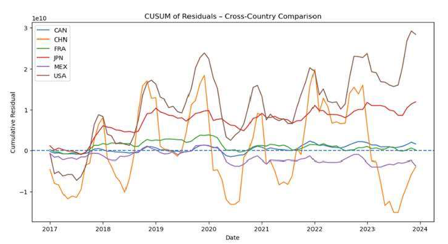
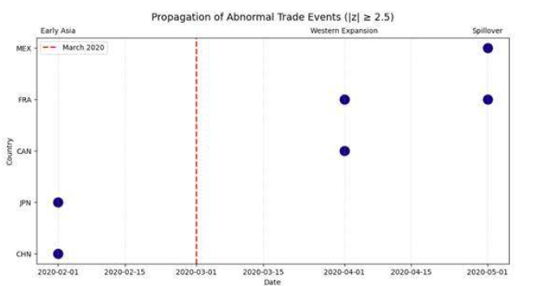
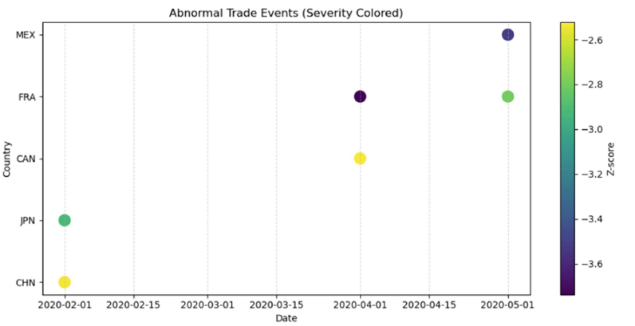

# sandia-trade-instability-analysis
Machine learning and time-series analysis of international trade disruption using UN Comtrade data.
# Trade Variability During Global Disruption

## Overview

This project was completed as part of the Master of Science in Analytics Practicum in collaboration with Sandia National Laboratories.

The objective was to analyze how international trade patterns change before, during, and after major global disruptions using machine learning and statistical techniques.

The study focused on identifying structural instability in trade behavior and evaluating methods capable of detecting disruption timing, persistence, and recovery patterns across multiple countries.

---

## Business Problem

Global events such as pandemics, geopolitical conflicts, and supply chain disruptions can significantly alter international trade flows.

Traditional trend analysis often fails to identify abrupt structural changes in trade behavior.

This project investigates whether statistical and machine learning approaches can detect these changes and provide insights into trade resilience.

---

## Dataset

**Source:** United Nations Comtrade Database (UN Comtrade)

**Countries Analyzed**
- United States
- Canada
- Mexico
- France
- Japan
- China

**Commodity Focus**
- Electrical Machinery Imports

**Time Period**
- 2017–2023

---

## Methods

- Exploratory Data Analysis (EDA)
- Time-Series Analysis
- Z-Score Anomaly Detection
- CUSUM Change Detection
- Piecewise Regression
- Structural Break Detection

---

## Tools & Technologies

- Python
- R
- Pandas
- NumPy
- Matplotlib
- Scikit-Learn

---

## Key Questions

- How do trade patterns change during major disruptions?
- Can structural breaks be detected automatically?
- Are disruption effects temporary or persistent?
- Do countries respond differently to disruptions?

---

## Results

The analysis identified measurable shifts in trade behavior associated with major global disruptions and demonstrated the value of structural break detection techniques for understanding supply chain instability and recovery patterns.

---
## Key Visualizations

### Cross-Country Structural Break Detection (CUSUM Analysis)

This analysis identifies structural changes in international trade behavior and highlights disruption periods across countries.

---

### Propagation of Abnormal Trade Events

This visualization illustrates how disruption effects propagate across trading partners during major global events.

---

### Severity of Abnormal Trade Events

Z-score analysis was used to evaluate the intensity and persistence of abnormal trade events across countries.

## Practicum Partner

Sandia National Laboratories

---

## Author

Nora Perotti  
M.S. Analytics – Georgia Institute of Technology
